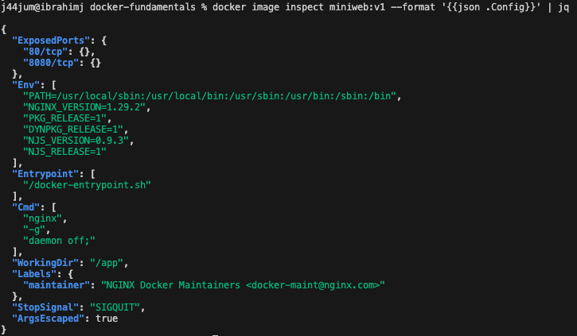

# Docker-fundamentals 

- Deliverables

Build & push three tiny images
   - stamp
   - envprobe
   - miniweb
Networking deep-dive exploring the below docker network types
   - Default bridge network
   - user-defined bridge network
   - Host network
Introspection, basic lifecycle, and hygiene

---

## Acceptance

✅ Repository: public Repo.  
✅ Images: three public images exist on Docker Hub with the exact tags:  
<DOCKERHUB_USERNAME>/stamp:v1  
<DOCKERHUB_USERNAME>/envprobe:v1  
<DOCKERHUB_USERNAME>/miniweb:v1  
✅ stamp: prints one UTC timestamp and exits; evidence screenshot + brief description of Dockerfile instructions.  
✅ envprobe: runs as non-root in your chosen working directory, prints one status line, remains alive for inspection; exec screenshots and file note included.  
✅ miniweb: serves your professional page on container port 8080; browser (or terminal) screenshot included with header + your name.  
✅ Networking: default bridge vs user-defined vs host network observations are correct and concise, each with screenshots and brief explanations.  
✅ Introspection: screenshots show images, containers, and key image configuration fields; short paragraph on image/container and tag/digest distinctions.

---

## Deliverable 1 — Build & push three tiny images

### A. UTC Stamp - prints a UTC timestamp once, then exits

Docker Hub Page  
  
   - Default bridge network  
   - user-defined bridge network  
   - Host network               

- Docker build command: docker build -t stamp:v1 -f Dockerfile.utc-timestamp .  
- docker run command: docker run --rm -d --name utc-timestamp:v1 stamp:v1  
  

Dockerfile instructions to build image:  
FROM: to set the base image  
WORKDIR: to set working project directory  
CMD: to execute command inside the container

---

### B. envprobe - prints who/where it’s running, then stays alive for inspection

- Docker build image :docker build -t envprobe:v1 -f Dockerfile.envprobe .  
- docker run command : docker run -d --name envprobe:v1 envprobe:v1

Docker Hub Page  

Running container  

---

### C. Miniweb Task - serves a professional static page on port 8080

Docker Hub page  
  
Rendered Page  

- I confirmed the page being served by opening the URL through the port exposed in my Dockerfile: http://localhost:8080/ as well as running curl -i localhost:8080

---

## Deliverable 2 — Networking deep-dive (default bridge, user-defined bridge, host)

Using images from Deliverable 1:  
 - Server : miniweb  
 - Client : envprobe

### A. Default bridge (no custom network)
- Result of attempt to reach 'miniweb' from inside 'envprobe'  
  
- The default bridge network doesn’t support automatic DNS resolution for container names. Containers can only communicate with each other by using their IP addresses.

  
- The above shows that my host machine is able to to access the site on port 8080, this is because the host port is mapped to the container on the default bridge network.

### B. User-defined bridge (for multi-container)
  
  
  
- On a user-defined bridge network, Docker runs an embedded DNS server that automatically resolves container names to their IP addresses and keeps the records up to date as containers start or stop. Since both containers are connected to the same user-defined bridge, envprobe can resolve miniwebcontainer and successfully access it at http://miniwebcontainer:8080/.

### C. Host network (observation)

- Observation : I ran the container on macOS with a published host port (-p 8080:80). The site was only accessible at http://localhost:8080 because Docker Desktop maps the container port to the VM and then exposes it on the host. The --network host option didn’t work on macOS since it’s only supported on Linux. Using -p is the reliable, cross-platform way to expose services.

---

## Deliverable 3 - Introspection, basic lifecycle, and hygiene

### A. Introspection snapshots
  

Screenshots showing configured WRKDIR, User & exposed ports  
docker image inspect miniweb:v1 --format '{{json .Config}}' | jq  

Difference between image and container;  
- A Docker image is a static snapshot of an application along with all its dependencies, while a container is a running instance of that image.

Difference between a tag and a digest;  
- A tag is a human-readable label you assign to an image, often used for versioning. A digest is a cryptographic hash of the image manifest in a registry and points to the exact same image at the byte level.

A safe way to stop and remove a container when done.  
- Running the following commands ensure safe stopage and removal of a container  
  1. docker run --rm  
  2. docker rm  
  3. docker stop

### B. Exec Proof (envprobe)  

